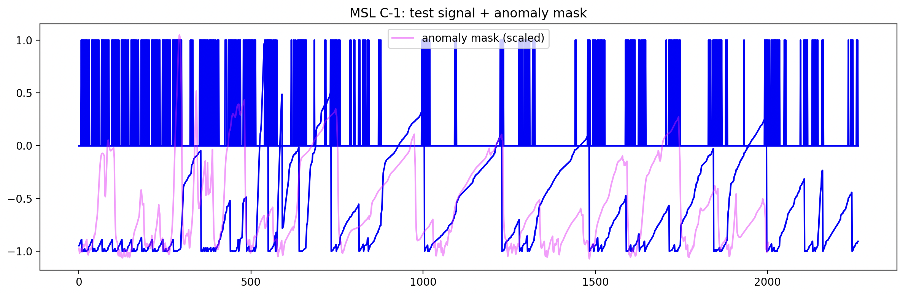

[1 week]

- La struttura del progetto è stata definita:
  - src: Dove la parte logica del progetto è definita.
  - scripts: Qui ci sono gli entrypoint
  - configs: Per esempio se vogliamo avere la riproducibilità qui possiamo salvare config che sono riutilizzabili
  - artifacts:
  - data: I dati che vogliamo utilizzare
  - tests
- Ho clonato il progetto NASA Anomaly Detection Dataset SMAP, questo è un dataset che proviene da un paper nei quali si studiano le anomalie.
  C'è un modello alla base quindi si ritrvano i dati di train e test.
- Ho creato il primo script che:
  - Recupera i dati
  - Stampa train shape, test shape e labels shape e l'anomaly ratio
  - Crea il grafico

- La linea blu sono i valori reali;
- le linee blu grosse è una sequenza binaria che indica dove un punto è anomalo o meno
- la linea rosa una maschera di anomalie
